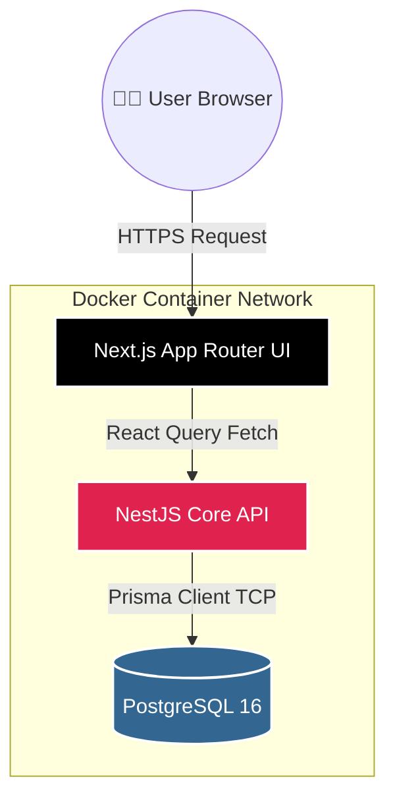
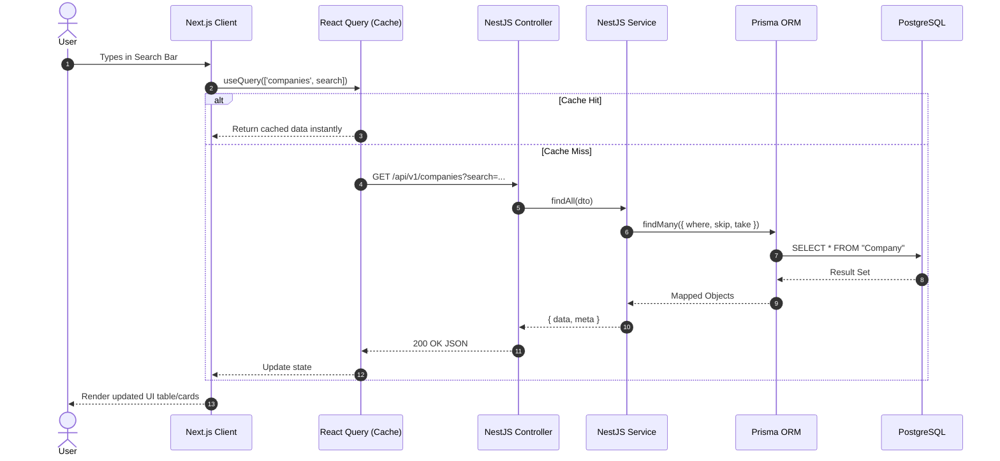
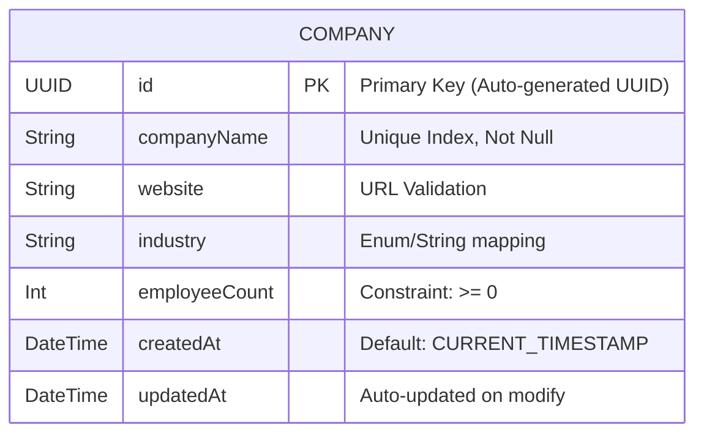

# 🏢 Prameela OneSuite - Company Directory Platform

[](https://nextjs.org/)
[](https://nestjs.com/)
[](https://www.prisma.io/)
[](https://www.typescriptlang.org/)
[](https://www.postgresql.org/)
[](https://www.docker.com/)

A premium, highly scalable, modular monolith full-stack application engineered for the Junior Full-Stack Developer Technical Assignment.

---

## 🏗️ 1. High-Level System Architecture (HLD)

The system leverages a heavily decoupled frontend/backend architecture operating within a unified monorepo to maximize developer velocity while maintaining strict boundaries.



---

## 🔄 2. API Request Lifecycle (Sequence Diagram)

This demonstrates the exact flow of data when a user searches or paginates through the company directory.



---

## 🗄️ 3. Database Entity Relationship (LLD)

The core domain relies on a heavily constrained, index-optimized schema to ensure data integrity and fast searches.



---

## 🛠️ 4. Comprehensive Technology Stack

| Domain | Core Technology | Role & Purpose | Version |
| :--- | :--- | :--- | :--- |
| **Frontend Framework** | **Next.js (App Router)** | Provides Server-Side Rendering (SSR), layout management, and routing. | `15.x` |
| **Data Fetching** | **TanStack Query** | Handles asynchronous state, aggressive caching, and pagination synchronization. | `5.x` |
| **UI & Styling** | **Tailwind CSS + shadcn** | Utility-first CSS framework coupled with highly accessible radix-ui components. | `3.x` |
| **Backend Framework** | **NestJS** | Enterprise-grade API framework utilizing strict Controller-Service-Module patterns. | `11.x` |
| **Database ORM** | **Prisma ORM** | Provides type-safe database interactions and programmatic schema migrations. | `7.x` |
| **Database Engine** | **PostgreSQL** | Robust relational persistence layer for complex, structured querying. | `16` |
| **DevOps / CI** | **Docker + GitHub Actions** | Container orchestration for deployments and automated testing pipelines. | `Latest` |

---

## 📂 5. Monorepo Project Structure

| Directory | Type | Description |
| :--- | :--- | :--- |
| `apps/web/` | **Next.js UI** | Contains all frontend React components, pages, hooks, and CSS. |
| `apps/api/` | **NestJS API** | Contains backend controllers, services, DTOs, and Exception filters. |
| `apps/api/prisma/` | **Database** | Houses `schema.prisma` definitions and generated SQL migrations. |
| `.github/workflows/`| **CI/CD** | Contains the `ci.yml` pipeline that triggers on every push/PR. |
| `docker-compose.yml`| **Infra** | The root orchestration file that binds Web, API, and Postgres together. |

---

## 🚀 6. Setup & Installation Guide

### Option A: The Docker Route (Highly Recommended)
Launch the entire ecosystem with zero manual configuration.

- **Step 1:** Ensure **Docker Desktop** is running.
- **Step 2:** Clone this repository.
- **Step 3:** Build and initialize the network:
  ```bash
  docker-compose up --build
  ```
- **Step 4:** Launch the **Frontend**: [http://localhost:3000](http://localhost:3000)
- **Step 5:** Monitor the **Backend API**: [http://localhost:4000/api/v1](http://localhost:4000/api/v1)

### Option B: The Local Development Route (Node & npm)
For granular control, debugging, and Hot Module Replacement (HMR).

- **Step 1:** Install all monorepo dependencies:
  ```bash
  npm install
  ```
- **Step 2:** Spin up just the PostgreSQL container:
  ```bash
  docker-compose up postgres -d
  ```
- **Step 3:** Generate types and apply database schemas:
  ```bash
  cd apps/api
  npx prisma generate
  npx prisma migrate deploy
  cd ../..
  ```
- **Step 4:** Boot the **NestJS Backend**:
  ```bash
  npm run start:dev --workspace=apps/api
  ```
- **Step 5:** Boot the **Next.js Frontend**:
  ```bash
  npm run dev --workspace=apps/web
  ```

---

## 🔌 7. RESTful API Endpoints

The backend exposes a highly standardized REST API. 

| Method | Endpoint | Payload / Query Params | Expected Response | Description |
| :--- | :--- | :--- | :--- | :--- |
| **POST** | `/api/v1/companies` | `{ companyName, website, ... }` | `201 Created` (Company Obj) | Creates a new company entry. |
| **GET** | `/api/v1/companies` | `?page=1&limit=10&search=Acme` | `200 OK` `{ data, meta }` | Returns paginated & filtered list. |
| **DELETE** | `/api/v1/companies/:id`| URL Param: `id` (UUID) | `200 OK` (Deleted Obj) | Deletes a company permanently. |

---

## ⚙️ 8. Environment Configuration

Every workspace operates within its own secure environment boundary.

| Workspace | Variable Name | Required | Default / Example | Purpose |
| :--- | :--- | :---: | :--- | :--- |
| `apps/api` | `DATABASE_URL` | **Yes** | `postgresql://...` | Connects NestJS to PostgreSQL. |
| `apps/api` | `PORT` | No | `4000` | Defines the API listening port. |
| `apps/api` | `CORS_ORIGIN` | No | `http://localhost:3000` | Locks down cross-origin requests. |
| `apps/api` | `RENDER_EXTERNAL_URL` | No | *(Empty)* | Enables an automated 14-minute self-ping to prevent free-tier shutdowns. |
| `apps/web` | `NEXT_PUBLIC_API_URL` | No | `http://localhost:4000/api/v1` | Instructs the frontend where to route API calls. |

---

## 🧠 9. Architectural Assumptions

- **Pagination Approach:** 
  - Implemented **Offset-based pagination** (using Prisma's `skip` and `take`) instead of cursor-based pagination. This assumes a moderate dataset where the complexity overhead of cursors is unnecessary.
- **Security Posture:** 
  - Assumed an MVP (Minimum Viable Product) state requiring no JWT/OAuth user authentication. Endpoints intentionally remain public for immediate testing simplicity.
- **Mobile User Experience (UX):** 
  - Assumed standard HTML tables provide a poor, horizontal-scrolling experience on mobile devices. 
  - Actively replaced traditional tables with an industry-standard, fully responsive stacked **Card View** on mobile breakpoints.

---

## ⚠️ 10. Known Limitations

- **Bulk Deletion Scalability:** 
  - The UI currently supports bulk deletion via checkboxes. However, selecting and deleting *tens of thousands* of rows simultaneously might exceed standard HTTP URL length limits if passed incorrectly.
- **Search Latency on Large Datasets:** 
  - The search functionality relies on a basic SQL `ILIKE` clause. Devoid of a dedicated full-text search index (e.g., the Postgres `pg_trgm` extension), query performance may experience slight degradation on massive datasets.

---

## 🔮 11. Future Roadmap

- **Authentication (JWT Guards):** Implement strict Authorization Guards in NestJS to restrict database write/delete operations solely to authenticated administrators.
- **React Server Components (RSC):** Migrate baseline data fetching directly to the server within the Next.js App Router to vastly reduce client-side JavaScript payloads and improve SEO.
- **Optimistic UI Updates:** Integrate React Query `onMutate` properties to provide instantaneous, zero-latency visual feedback during company creation and deletion.
- **Automated Mock Seeding:** Introduce `Faker.js` scripts to instantly populate the database with 10,000+ realistic mock data rows upon initial deployment for load testing.
