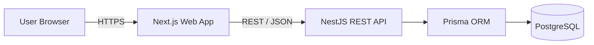
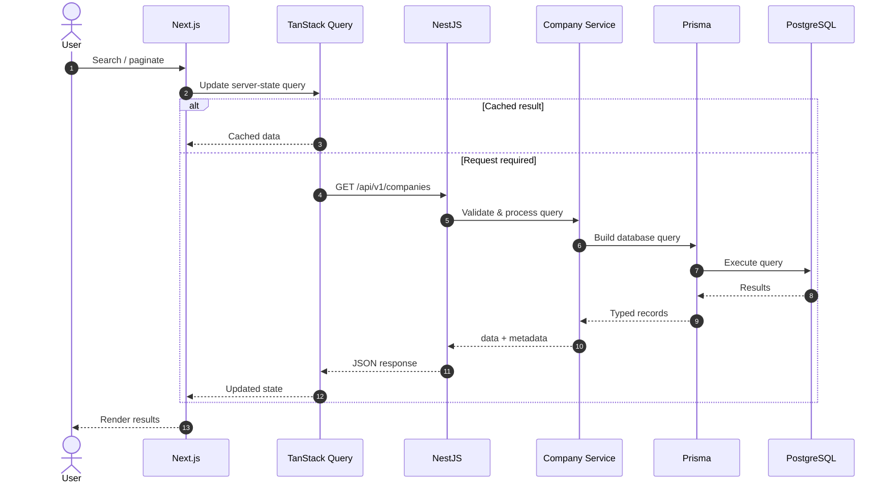
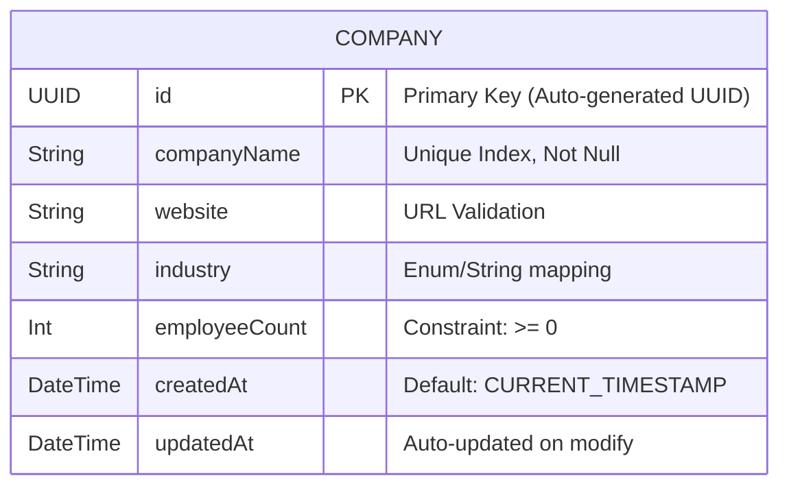

# Prameela OneSuite --- Company Directory

A production-oriented full-stack Company Management System built for the
Prameela OneSuite Full-Stack Developer technical assignment.

[](https://nextjs.org/)
[](https://nestjs.com/)
[](https://www.prisma.io/)
[](https://www.typescriptlang.org/)
[](https://www.postgresql.org/)
[](https://www.docker.com/)

## Live Demo

| Application     | URL                                         |
| :-------------- | :------------------------------------------ |
| **Frontend**    | https://prameela-assignment-web.vercel.app/ |
| **Backend API** | https://prameela-api.vercel.app/api/v1      |

> The frontend is the primary entry point. The backend URL is provided
> for API verification.

---

## What It Does

The application provides a focused company directory with:

- Create company
- Search companies by name
- Paginated and sortable company listing
- Delete company
- Responsive desktop/tablet/mobile experience
- Client and server-side validation
- Loading, empty, error, and mutation states

The implementation deliberately keeps the system as a **modular
monolith**: simple enough for the domain, but structured with clear
boundaries that can evolve as requirements grow.

---

## Architecture



### Request lifecycle



### Backend boundary

```text
Controller
    ↓
Service
    ↓
Prisma
    ↓
PostgreSQL
```

### Frontend boundary

```text
UI Components
    ↓
React Query Hooks
    ↓
Typed API Client
    ↓
REST API
```

---

## Tech Stack

| Layer              | Technology               | Purpose                               |
| :----------------- | :----------------------- | :------------------------------------ |
| **Frontend**       | Next.js 15               | React application and routing         |
| **UI**             | Tailwind CSS + shadcn/ui | Styling and accessible primitives     |
| **Server State**   | TanStack Query           | Fetching, caching and synchronization |
| **Forms**          | React Hook Form + Zod    | Form state and validation             |
| **Backend**        | NestJS 11                | REST API and application structure    |
| **ORM**            | Prisma 7                 | Type-safe persistence and migrations  |
| **Database**       | PostgreSQL 16            | Relational persistence                |
| **Testing**        | Jest / Vitest / RTL      | Unit, integration and UI testing      |
| **Infrastructure** | Docker                   | Reproducible local environment        |
| **CI**             | GitHub Actions           | Automated build and test validation   |

---

## Project Structure

```text
.
├── apps/
│   ├── api/
│   │   ├── prisma/
│   │   └── src/
│   │       ├── companies/
│   │       ├── common/
│   │       └── main.ts
│   │
│   └── web/
│       └── src/
│           ├── app/
│           ├── components/
│           ├── hooks/
│           └── lib/
│

├── .github/workflows/
├── docker-compose.yml
├── package.json
└── README.md
```

The repository keeps frontend, backend, persistence, infrastructure, and
engineering documentation clearly separated.

---

## Data Model

The domain is intentionally small and currently consists of a single
`companies` table.



---

## 4. Comprehensive Technology Stack

| Domain   | Core Technology  | Role & Purpose             | Version          |
| :------- | :--------------- | :------------------------- | :--------------- |
| `POST`   | `/companies`     | Create company             | `201 Created`    |
| `GET`    | `/companies`     | List/search companies      | `200 OK`         |
| `DELETE` | `/companies/:id` | Permanently delete company | `204 No Content` |

The collection endpoint supports:

```text
?search=acme
?page=1&limit=20
?sortBy=createdAt&sortOrder=desc
```

These parameters can be combined.

Example:

```text
GET /api/v1/companies?search=acme&page=1&limit=20&sortBy=companyName&sortOrder=asc
```

The API validates query parameters and uses an explicit allowlist for
sortable fields.

---

## UX & Responsive Design

The UI is designed as a compact B2B management interface rather than a
marketing page.

### Desktop

Companies are presented in a semantic data table for fast scanning and
comparison.

### Mobile

The table becomes a purpose-designed stacked card layout instead of
forcing a wide desktop table into a narrow viewport.

### Designed states

- Initial loading / skeleton
- Background loading
- Empty database
- No search results
- Fetch error + retry
- Create validation errors
- Create pending/success/failure
- Delete confirmation
- Delete pending/success/failure

Accessibility is treated as part of the component design, including
semantic markup, keyboard navigation, visible focus states, accessible
dialogs/forms, reduced-motion support, and non-color-only status
communication.

---

## Local Development

### Prerequisites

- Node.js `>=22.12.0`
- npm `>=10`
- Docker

### 1. Clone and install

```bash
git clone https://github.com/harshitgour1/Prameela-Assignment-Harshit-Goud.git
cd Prameela-Assignment-Harshit-Goud
npm ci
```

### 2. Configure environment

Create the required environment files using the provided `.env.example`
files.

Backend:

```env
DATABASE_URL=
PORT=
CORS_ORIGIN=
```

Frontend:

```env
NEXT_PUBLIC_API_URL=
```

Do not commit real secrets.

### 3. Start PostgreSQL

```bash
docker compose up -d postgres
```

### 4. Prepare Prisma

```bash
npx prisma generate --schema apps/api/prisma/schema.prisma
npx prisma migrate dev --schema apps/api/prisma/schema.prisma
```

### 5. Start the applications

Backend:

```bash
npm run dev --workspace=apps/api
```

Frontend:

```bash
npm run dev --workspace=apps/web
```

---

## Docker

For a containerized local setup:

```bash
docker compose up --build
```

Docker is primarily used to make the local database/development
environment reproducible without requiring a manually installed
PostgreSQL server.

---

## Quality Checks

Run the project checks from the repository root:

```bash
npm run lint
npm run typecheck
npm run test
npm run build
```

The repository also includes GitHub Actions for automated validation.

---

## Testing

The project uses multiple levels of testing:

```text
Unit / Service Tests
        ↓
API E2E Tests
        ↓
Frontend Behaviour Tests
```

API E2E tests exercise the real application path through NestJS, Prisma,
and PostgreSQL rather than mocking the entire persistence layer.

The focus is on meaningful behavior and failure cases rather than
coverage numbers alone.

---

## Deployment

The project is structured as a monorepo with independently deployable
frontend and backend applications.

```text
                Internet
                   │
          ┌────────┴────────┐
          ▼                 ▼
       Vercel            Vercel
      Next.js         NestJS API
                             │
                             ▼
                        PostgreSQL
```

The production URLs are listed at the top of this README.

Deployment configuration is kept separate from application code, with
environment variables used for runtime configuration.

---

## Engineering Decisions

A few deliberate choices are worth calling out:

### Modular monolith

The domain does not justify microservices or distributed infrastructure.
A modular monolith keeps deployment and development simple while
preserving clear application boundaries.

### Server-side search

Search is executed in PostgreSQL instead of downloading the entire
dataset into the browser. PostgreSQL trigram indexing provides a
practical optimization for substring matching.

### Offset pagination

The company directory is an administrative/table-oriented interface, so
page/limit pagination is a better fit than cursor pagination.

### Server as source of truth

Create and delete mutations invalidate/refetch the relevant server state
rather than maintaining a second independent copy of the database state
in the browser.

### Validation at both boundaries

Frontend validation provides immediate feedback; backend validation
remains authoritative because the API must not trust any client.

---

## Known Scope & Limitations

The assignment intentionally does not require:

- authentication/authorization
- company editing
- soft deletion
- audit logging
- real-time updates
- dedicated search infrastructure

The current implementation therefore avoids these features rather than
introducing complexity without a requirement.

For substantially larger datasets or significantly more advanced search
requirements, PostgreSQL query/index performance should be measured and
the search strategy evolved based on actual workload.

---

## Documentation

Detailed engineering decisions are documented separately:

- `00-tech-stack-decisions.md`
- `01-architecture-hld.md`
- `02-low-level-design.md`
- `03-api-specification.md`
- `04-database-design.md`
- `05-testing-strategy.md`
- `06-cicd-deployment.md`
- `07-project-plan.md`
- UI/UX Design Specification

These documents contain the deeper architecture, implementation,
testing, deployment, and UX rationale behind the project.
Not commited in this repo, can be provided upon request.

---

## AI Usage

AI tools were used as engineering assistants during development.

[`AI_USAGE.md`](./AI_USAGE.md) documents:

- tools used
- where and why they were used
- representative prompts
- generated code retained
- generated code modified
- generated code rejected

AI-assisted code was reviewed, tested, and integrated deliberately. The
final implementation remains the responsibility of the developer.

---

## Repository

[GitHub
Repository](https://github.com/harshitgour1/Prameela-Assignment-Harshit-Goud)
